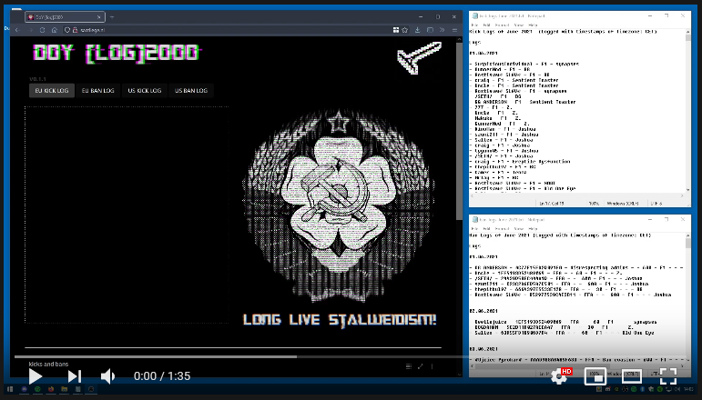

# DoY \[log\] 2000

## Install instructions
1. clone repo `git clone git@github.com:frankvanvuuren/doy-log-2000.git`
2. go to project root `cd doy-log-2000`
3. install dependencies `npm install`

## Development instructions
1. run `npm run dev`

## Build instuctions
1. run `npm run build`

## Demo

